# 음악의 재.구.SoNG
</td>

## 프로젝트 소개
**진행 기간** : 2024.10.14 ~ 2024.11.19  
**인원** : 5명 (인프라 1명, 백엔드 2명, 프론트 3명)

가수들이 꾸준히 리메이커곡을 발매하고 많은 리메이커곡이 원곡과는 비슷하면서 새로운 분위기로 사랑받고 있습니다. 가수뿐만 아니라 일반인들도 자신의 유튜브 채널에 커버곡을 올리는 경우가 많이 있습니다. 혹시 곡을 리메이커 하는 것에 관심이 있나요? 그런데 전문적인 음악지식과 편곡지식이 없어서 힘드신가요? 음원 재생산 플랫폼인 재구송이 쉽게 도와드립니다.

## 주요 기능
- 음원 분리
    - 음원을 업로드하면 세션별(보컬/각 악기)로 분리
- 세션별 음원 듣기
    - 각 세션을 선택할 수 있는 기능이 있어 듣고 싶은 세션만 선택해서 들을 수 있음
- 내 음원 추가
    - 다른 워크스페이스에 내가 추가하고 싶은 음원을 추가해서 함께 들을 수 있음
- 워크스페이스 포크 
    - 다른 사람의 음원을 듣고 추가하거나 수정하고 싶을 때 내 워크스페이스로 가져가 음원을 수정
- 시작 포인트 / 종료 포인트 설정
    - 듣고 싶은 구간을 설정
    - 시작 포인트와 종료 포인트 각각 설정
- 채팅
    - 플랫폼 내 다른 유저와 채팅
- 게임
    - 음감과 리듬감을 이용한 3가지 게임
- 크루
    - 크루에 가입해 다른 유저들과 소통
- 유저 정보 기반 유저 추천
    - 유저 정보(포지션, 장르, 지역)을 기반으로 유사한 유저 추천

## 서비스 화면

<table>
    <tr>
        <th style="text-align: center;">로그인 페이지</th>
        <th style="text-align: center;">메인 페이지</th>
    </tr>
    <tr>
        <td>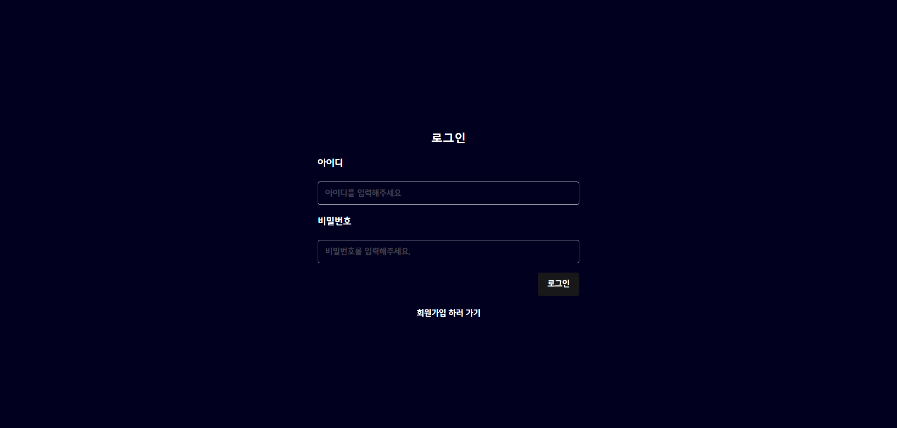</td>
        <td>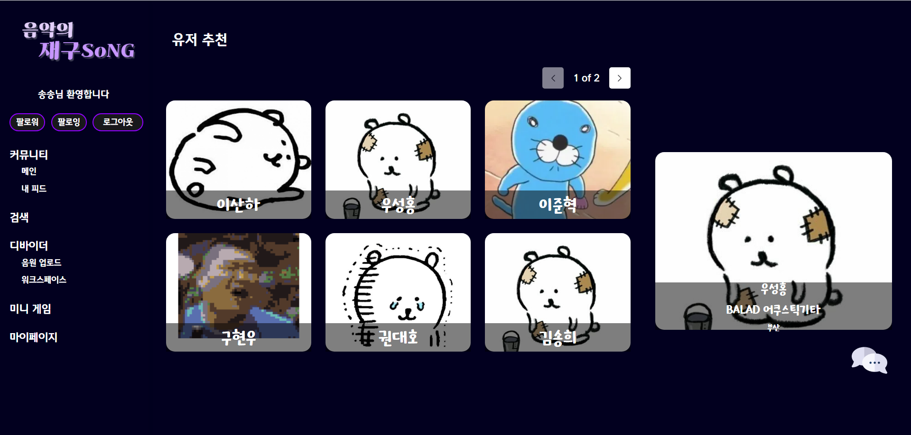</td>
    </tr>
    <tr>
        <th style="text-align: center;"> 음원 업로드 페이지</th>
        <th style="text-align: center;">워크스페이스 페이지</th>
    </tr>
    <tr>
        <td>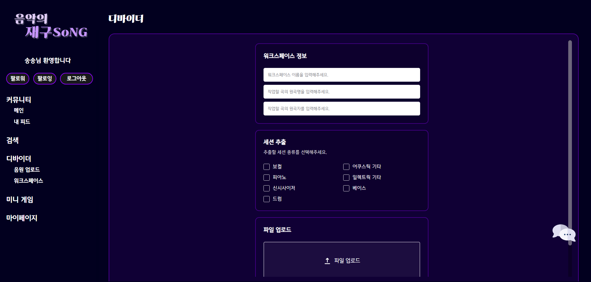</td>
        <td>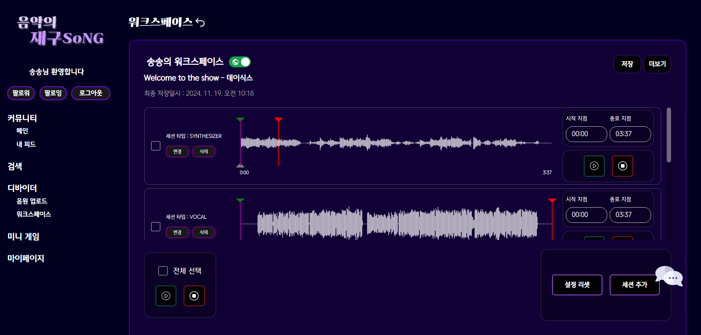</td>
    </tr>
    <tr>
        <th style="text-align: center;">피드 목록 페이지</th>
        <th style="text-align: center;">음원피드 목록 페이지</th>
    </tr>
    <tr>
        <td>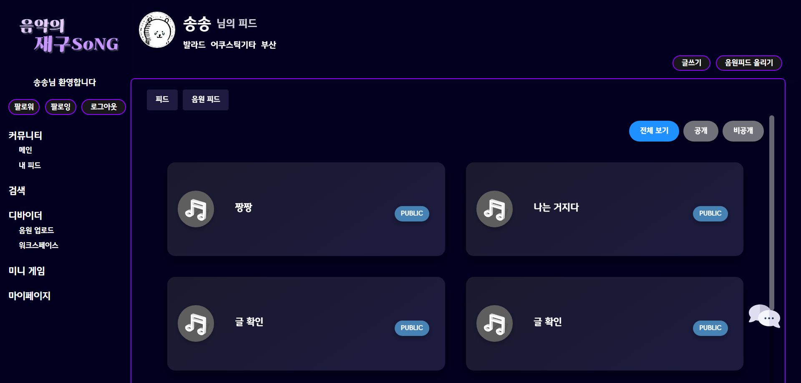</td>
        <td>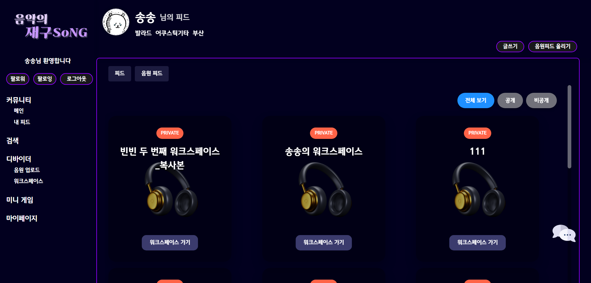</td>
    </tr>
    <tr>
        <th style="text-align: center;">게시물 상세 페이지</th>
        <th style="text-align: center;">게시물 생성 페이지</th>
    </tr>
    <tr>
        <td>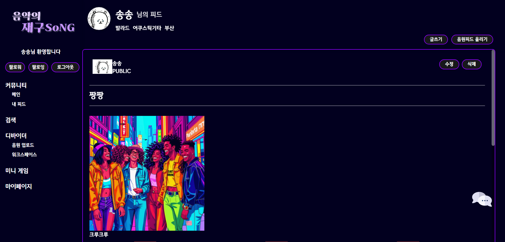</td>
        <td>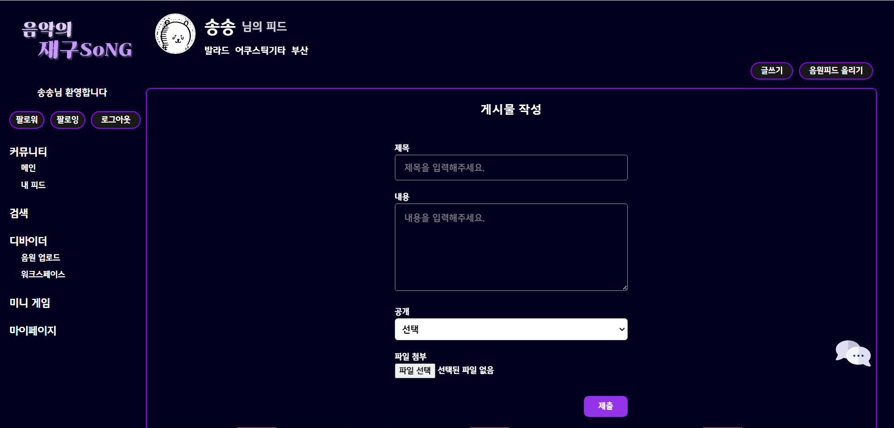</td>
    </tr>
    <tr>
        <th style="text-align: center;">마이페이지</th>
        <th style="text-align: center;">검색창</th>
    </tr>
    <tr>
        <td>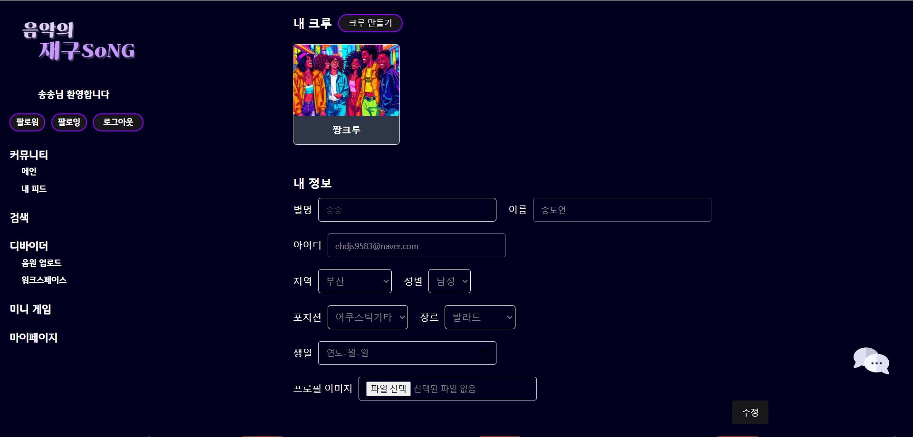</td>
        <td>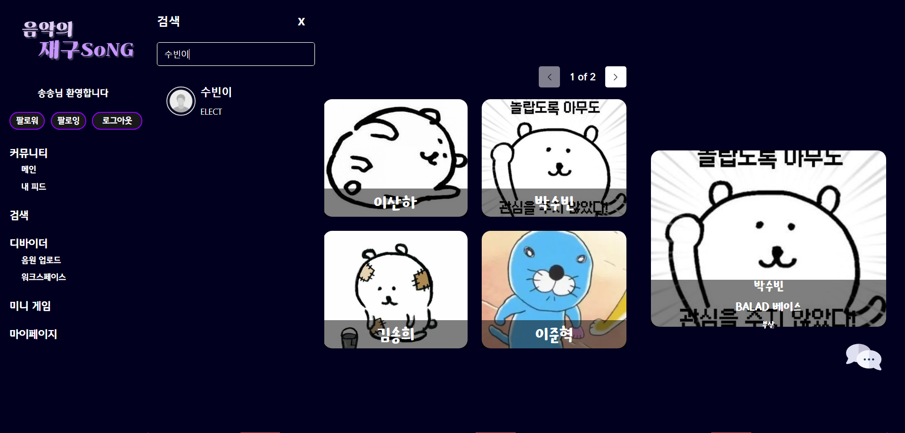</td>
    </tr>
        <tr>
        <th style="text-align: center;">채팅 목록</th>
        <th style="text-align: center;">채팅창</th>
    </tr>
    <tr>
        <td>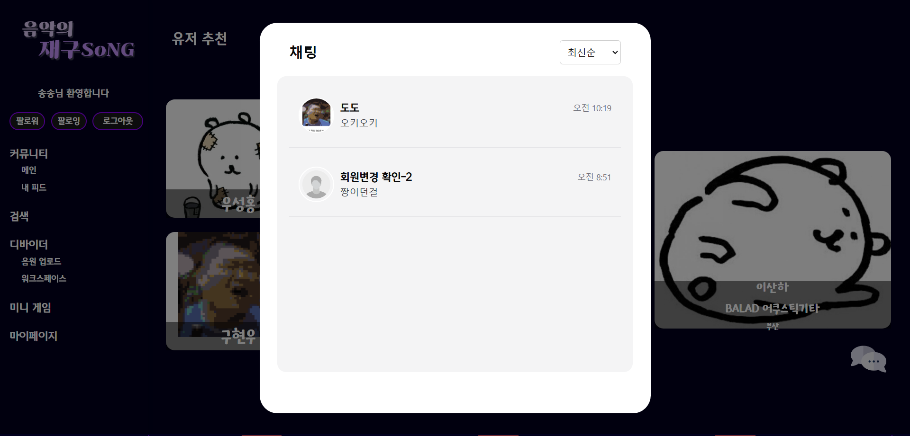</td>
        <td></td>
    </tr>
        <tr>
        <th style="text-align: center;">게임 페이지</th>
        <th style="text-align: center;">게임 상세 페이지</th>
    </tr>
    <tr>
        <td>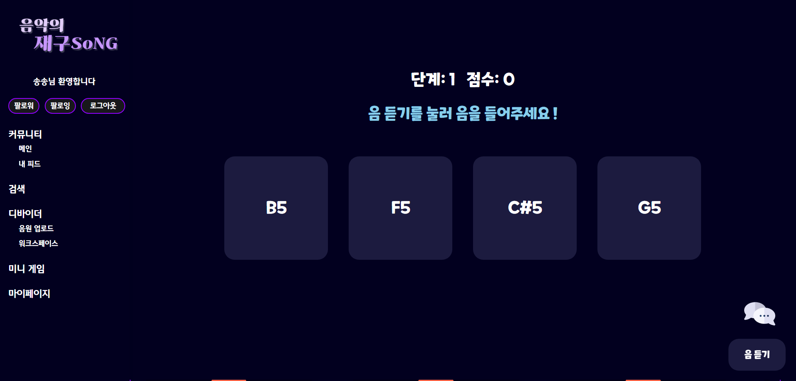</td>
        <td>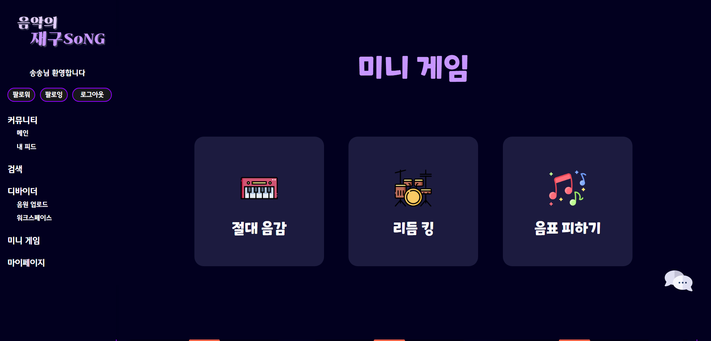</td>
    </tr>
</table>

## 주요 기술 스택

### 프론트엔드

### 백엔드

### DB

### Infra

### Tools

## 산출물

### 아키텍처
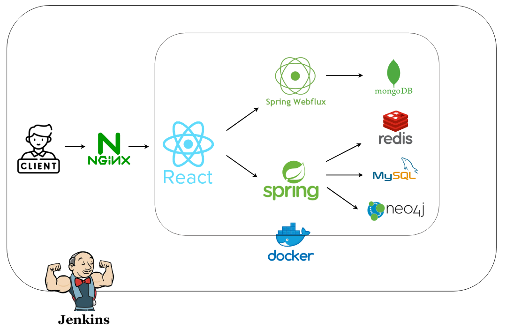</td>

## 팀원
<table>
    <tr>
        <th style="text-align: center;">박수빈</th>
        <th style="text-align: center;">권혜경</th>
        <th style="text-align: center;">구현우</th>
        <th style="text-align: center;">김송희</th>
        <th style="text-align: center;">송도언</th>
    </tr>
    <tr>
        <td style="text-align: center; vertical-align: baseline;">팀장 프론트엔드</td>
        <td style="text-align: center; vertical-align: baseline;">백엔드 webFlux 연결</td>
        <td style="text-align: center; vertical-align: baseline;">프론트엔드 webFlux 연결</td>
        <td style="text-align: center; vertical-align: baseline;">프론트엔드 백엔드</td>
        <td style="text-align: center; vertical-align: baseline;">인프라 백엔드 추천 알고리즘</td>
    </tr>
</table>

