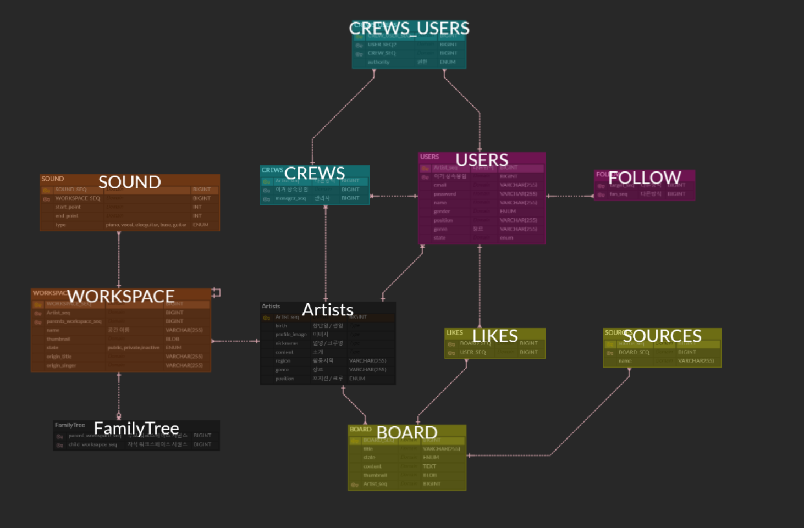

# 음악의 재.구.SoNG

</td>

## 프로젝트 소개

**진행 기간** : 2024.10.14 ~ 2024.11.19  
**인원** : 5명 (인프라 1명, 백엔드 2명, 프론트 3명)

가수들이 꾸준히 리메이커곡을 발매하고 많은 리메이커곡이 원곡과는 비슷하면서 새로운 분위기로 사랑받고 있습니다. 가수뿐만 아니라 일반인들도 자신의 유튜브 채널에 커버곡을 올리는 경우가 많이 있습니다. 혹시 곡을 리메이커 하는 것에 관심이 있나요? 그런데 전문적인 음악지식과 편곡지식이 없어서 힘드신가요? 음원 재생산 플랫폼인 재구송이 쉽게 도와드립니다.

## 주요 기능

- 음원 분리
  - 음원을 업로드하면 세션별(보컬/각 악기)로 분리
- 세션별 음원 듣기
  - 각 세션을 선택할 수 있는 기능이 있어 듣고 싶은 세션만 선택해서 들을 수 있음
- 내 음원 추가
  - 다른 워크스페이스에 내가 추가하고 싶은 음원을 추가해서 함께 들을 수 있음
- 워크스페이스 포크
  - 다른 사람의 음원을 듣고 추가하거나 수정하고 싶을 때 내 워크스페이스로 가져가 음원을 수정
- 시작 포인트 / 종료 포인트 설정
  - 듣고 싶은 구간을 설정
  - 시작 포인트와 종료 포인트 각각 설정
- 채팅
  - 플랫폼 내 다른 유저와 채팅
- 게임
  - 음감과 리듬감을 이용한 3가지 게임
- 크루
  - 크루에 가입해 다른 유저들과 소통
- 유저 정보 기반 유저 추천
  - 유저 정보(포지션, 장르, 지역)을 기반으로 유사한 유저 추천

## 서비스 화면

<table>
    <tr>
        <th style="text-align: center;">로그인 페이지</th>
        <th style="text-align: center;">메인 페이지</th>
    </tr>
    <tr>
        <td></td>
        <td></td>
    </tr>
    <tr>
        <th style="text-align: center;"> 음원 업로드 페이지</th>
        <th style="text-align: center;">워크스페이스 페이지</th>
    </tr>
    <tr>
        <td></td>
        <td></td>
    </tr>
    <tr>
        <th style="text-align: center;">피드 목록 페이지</th>
        <th style="text-align: center;">음원피드 목록 페이지</th>
    </tr>
    <tr>
        <td></td>
        <td></td>
    </tr>
    <tr>
        <th style="text-align: center;">게시물 상세 페이지</th>
        <th style="text-align: center;">게시물 생성 페이지</th>
    </tr>
    <tr>
        <td></td>
        <td></td>
    </tr>
    <tr>
        <th style="text-align: center;">마이페이지</th>
        <th style="text-align: center;">검색창</th>
    </tr>
    <tr>
        <td></td>
        <td></td>
    </tr>
        <tr>
        <th style="text-align: center;">채팅 목록</th>
        <th style="text-align: center;">채팅창</th>
    </tr>
    <tr>
        <td></td>
        <td></td>
    </tr>
        <tr>
        <th style="text-align: center;">게임 페이지</th>
        <th style="text-align: center;">게임 상세 페이지</th>
    </tr>
    <tr>
        <td></td>
        <td></td>
    </tr>
</table>

## 주요 기술 스택

### 프론트엔드

### 백엔드

### DB

### Infra

### Tools

## 산출물

### 아키텍처

</td>

### ERD

</td>

## 팀원

<table style="width: 100%; border-collapse: collapse;">
    <thead>
        <tr>
            <th style="text-align: center;">이름</th>
            <th style="text-align: center;">역할</th>
            <th style="text-align: center;">세부사항</th>
        </tr>
    </thead>
    <body>
        <tr>
            <td style="text-align: center; vertical-align: middle;">박수빈</td>
            <td style="text-align: center; vertical-align: middle;">팀장 프론트엔드</td>
            <td>
                -로그인/회원가입
                 &nbsp;&nbsp;&nbsp;&nbsp;-이메일 인증을 통한 회원가입
                 -커뮤니티
                 &nbsp;&nbsp;&nbsp;&nbsp;-메인 페이지
                 &nbsp;&nbsp;&nbsp;&nbsp;&nbsp;&nbsp;&nbsp;&nbsp;-유저 정보 기반의 다른 유저 추천
                 &nbsp;&nbsp;&nbsp;&nbsp;-유저 개인 및 크루 피드
                 &nbsp;&nbsp;&nbsp;&nbsp;&nbsp;&nbsp;&nbsp;&nbsp;-글 생성 및 수정 페이지, 글 삭제
                 &nbsp;&nbsp;&nbsp;&nbsp;&nbsp;&nbsp;&nbsp;&nbsp;-댓글 및 대댓글 생성, 수정, 삭제
                 &nbsp;&nbsp;&nbsp;&nbsp;&nbsp;&nbsp;&nbsp;&nbsp;-PUBLIC/PRIVATE 필터링 적용
                 &nbsp;&nbsp;&nbsp;&nbsp;&nbsp;&nbsp;&nbsp;&nbsp;-Zustand를 이용해 유저 및 크루 헤더 정보 변경
                 &nbsp;&nbsp;&nbsp;&nbsp;&nbsp;&nbsp;&nbsp;&nbsp;-피드장에게만 글쓰기 기능 부여
                 -크루 
                 &nbsp;&nbsp;&nbsp;&nbsp;- 크루 생성 및 수정 페이지
                 &nbsp;&nbsp;&nbsp;&nbsp;- 크루장에 다른 크루원에게 피드장/채팅장 권한 부여
                 &nbsp;&nbsp;&nbsp;&nbsp;- 크루장은 크루 가입을 신청한 유저를 승인 혹은 거절
                 -팔로우 
                 &nbsp;&nbsp;&nbsp;&nbsp;-다른 유저를 팔로우하는 기능 구현
                 &nbsp;&nbsp;&nbsp;&nbsp;-팔로우/팔로워 목록 생성
                 -Chakra UI를 활용한 컴포넌트 디자인 
                 &nbsp;&nbsp;&nbsp;&nbsp;-커뮤니티
            </td>
        </tr>    
        <tr>
            <td style="text-align: center; vertical-align: middle;">권혜경</td>
            <td style="text-align: center; vertical-align: middle;">백엔드</td>
            <td>-유저
                 &nbsp;&nbsp;&nbsp;&nbsp;-로그인/회원가입
                 &nbsp;&nbsp;&nbsp;&nbsp;&nbsp;&nbsp;&nbsp;&nbsp;-이메일 인증을 통한 회원가입
                 &nbsp;&nbsp;&nbsp;&nbsp;&nbsp;&nbsp;&nbsp;&nbsp;-이름 길이 제한
                 &nbsp;&nbsp;&nbsp;&nbsp;&nbsp;&nbsp;&nbsp;&nbsp;-text 정보는 json으로 받고 프로필 사진 이미지는 파일로 받는다?(수정)
                 &nbsp;&nbsp;&nbsp;&nbsp;&nbsp;&nbsp;&nbsp;&nbsp;-액세스 토큰 재발급
                 -크루
                 &nbsp;&nbsp;&nbsp;&nbsp;-크루 관련 API
                 &nbsp;&nbsp;&nbsp;&nbsp;&nbsp;&nbsp;&nbsp;&nbsp;-생성 및 수정, 탈퇴
                 &nbsp;&nbsp;&nbsp;&nbsp;&nbsp;&nbsp;&nbsp;&nbsp;-크루 가입 신청
                 &nbsp;&nbsp;&nbsp;&nbsp;&nbsp;&nbsp;&nbsp;&nbsp;-크루 가입 신청 승인, 거절
                 &nbsp;&nbsp;&nbsp;&nbsp;&nbsp;&nbsp;&nbsp;&nbsp;-피드장, 채팅장 권한 부여
                 -커뮤니티
                 &nbsp;&nbsp;&nbsp;&nbsp;-커뮤니티 관련 API
                 &nbsp;&nbsp;&nbsp;&nbsp;&nbsp;&nbsp;&nbsp;&nbsp;-피드 생성 및 수정, 삭제
                 &nbsp;&nbsp;&nbsp;&nbsp;&nbsp;&nbsp;&nbsp;&nbsp;-피드 리스트 조회
                 &nbsp;&nbsp;&nbsp;&nbsp;&nbsp;&nbsp;&nbsp;&nbsp;-게시물 상세페이지 조회
                 &nbsp;&nbsp;&nbsp;&nbsp;&nbsp;&nbsp;&nbsp;&nbsp;-댓글 및 대댓글 생성, 수정, 삭제
                 -채팅
                 &nbsp;&nbsp;&nbsp;&nbsp;-WebFlux과 ReactiveMongoDB를 활용해 실시간 채팅 구현
            </td>
        </tr>    
        <tr>
            <td style="text-align: center; vertical-align: middle;">구현우</td>
            <td style="text-align: center; vertical-align: middle;">프론트엔드</td>
            <td>-게임
             &nbsp;&nbsp;&nbsp;&nbsp;-Tone.js를 활용해 음감 게임 생성
             &nbsp;&nbsp;&nbsp;&nbsp;-나의 음성 높낮이를 받아와서 음표 피하기 게임을 개발
             &nbsp;&nbsp;&nbsp;&nbsp;-실제 드럼의 소리를 받아와서 리듬 게임 개발
             -채팅
             &nbsp;&nbsp;&nbsp;&nbsp;-실시간 채팅 구현
             &nbsp;&nbsp;&nbsp;&nbsp;-채팅방 목록 구현
             -검색
             &nbsp;&nbsp;&nbsp;&nbsp;-반응형을 활용한 검색 컴포넌트 실행
             &nbsp;&nbsp;&nbsp;&nbsp;-검색어를 입력하면 실시간으로 일치하는 유저 출력
             -Chakra UI를 활용한 컴포넌트 디자인
             &nbsp;&nbsp;&nbsp;&nbsp;-채팅, 게임, 커뮤니티, 검색, 네비바
             -Jira 관리</td>
        </tr>    
        <tr>
            <td style="text-align: center; vertical-align: middle;">김송희</td>
            <td style="text-align: center; vertical-align: middle;">프론트엔드 백엔드</td>
            <td>-워크스페이스
                 &nbsp;&nbsp;&nbsp;&nbsp;-`wavesurfer.js` 음원 파형 시각화
                 &nbsp;&nbsp;&nbsp;&nbsp;&nbsp;-`wavesurfer.js` -라이브러리를 를  활용해 사용자가 업로드한 음원의 파형을 시각화.
                 &nbsp;&nbsp;&nbsp;&nbsp;&nbsp;-`wavesurfer.js` -각 음원의 시작, 종료 지점을 설정할 수 있도록 UI에 커서를 추가하고, `zustand`를 이용해 글로벌 상태로 관리.
                 &nbsp;&nbsp;&nbsp;&nbsp;음원 수정 기능
                 &nbsp;&nbsp;&nbsp;&nbsp;&nbsp;`react-rnd`를 사용하여 음원의 세션 영역을 드래그하여 수정 가능.
                 &nbsp;&nbsp;&nbsp;&nbsp;&nbsp;-사용자의 세션 수정 사항은 `zustand`와 `wavesurfer.js` 간 동기화를 통해 정확하게 반영.
                 &nbsp;&nbsp;&nbsp;&nbsp;&nbsp;-오프셋(offset)이 발생하는 세션에 대해 동시 재생 시 문제를 해결하기 위해, 커스텀 로직으로 `setTimeout`을 활용하여 재생 동기화 처리.
                 &nbsp;&nbsp;&nbsp;&nbsp;&nbsp;-사용자가 설정한 글로벌 시작/종료 지점 및 각 세션의 오프셋을 기반으로 모든 음원이 자연스럽게 동시 재생되도록 구현.
                 &nbsp;&nbsp;&nbsp;&nbsp;상태 관리 및 동기화
                 &nbsp;&nbsp;&nbsp;&nbsp;&nbsp;-`zustand`를 사용하여 세션 데이터(시작 지점, 종료 지점, 오프셋 등)와 글로벌 설정(재생 범위, 동기화 상태)을 관리.
                 &nbsp;&nbsp;&nbsp;&nbsp;&nbsp;-`zustand`, `wavesurfer.js`, `react-rnd` 간의 데이터 흐름을 효과적으로 조합하여 사용자 경험을 개선.
                 &nbsp;&nbsp;&nbsp;&nbsp;&nbsp;-글로벌 재생 모드 구현 시 오프셋이 적용된 세션의 음원이 정상적으로 재생되도록 상태를 업데이트하고 동기화.
                 -팔로우
                 &nbsp;&nbsp;&nbsp;&nbsp;-팔로우 관련 API
                 &nbsp;&nbsp;&nbsp;&nbsp;&nbsp;&nbsp;&nbsp;&nbsp;-팔로우/언팔로우 기능 구현
                 &nbsp;&nbsp;&nbsp;&nbsp;&nbsp;&nbsp;&nbsp;&nbsp;-팔로우/언팔로우 기능 구현
                 -Chakra UI를 활용한 컴포넌트 디자인 
                 &nbsp;&nbsp;&nbsp;&nbsp;-워크스페이스 화면 디자인
                 &nbsp;&nbsp;&nbsp;&nbsp;-음원 업로드 페이지 디자인
            </td>
        </tr>    
        <tr>
            <td style="text-align: center; vertical-align: middle;">송도언</td>
            <td style="text-align: center; vertical-align: middle;">인프라 백엔드</td>
            <td>-서버 구축
                 -워크스페이스
                 &nbsp;&nbsp;&nbsp;&nbsp;-음원 분리 AI(이름 뭐더랑)을 이용해 세션별 분리
                 &nbsp;&nbsp;&nbsp;&nbsp;-워크스페이스 관련 API
                 &nbsp;&nbsp;&nbsp;&nbsp;-워크스페이스 관련 API
                 &nbsp;&nbsp;&nbsp;&nbsp;&nbsp;&nbsp;&nbsp;&nbsp;-워크스페이스 생성 및 삭제
                 &nbsp;&nbsp;&nbsp;&nbsp;&nbsp;&nbsp;&nbsp;&nbsp;-세션 추가
                 &nbsp;&nbsp;&nbsp;&nbsp;&nbsp;&nbsp;&nbsp;&nbsp;-워크스페이스 목록
                 &nbsp;&nbsp;&nbsp;&nbsp;&nbsp;&nbsp;&nbsp;&nbsp;-워크스페이스 상세 페이지
                 &nbsp;&nbsp;&nbsp;&nbsp;&nbsp;&nbsp;&nbsp;&nbsp;-다른 유저 워크스페이스 포크
                 -추천 알고리즘
                 &nbsp;&nbsp;&nbsp;&nbsp;-그래프DB를 활용한 유저 추천
            </td>
        </tr> 
    </body>   
</table>
